<p align="center">
  
</p>

<h1 align="center">OCTO</h1>

<p align="center">
  Un client ChatGPT open source pour iOS 26, sans télémétrie, qui reprend l'interface de l'app ChatGPT avec les composants Liquid Glass d'Apple.<br>
  <em>An open-source, telemetry-free ChatGPT client for iOS, built with Apple's Liquid Glass.</em>
</p>

---

## 📱 Aperçu

| Connexion | Nouveau chat | Conversation |
|:---:|:---:|:---:|
|  |  |  |
| **Barre latérale** | **Mode vocal** | **Chat supprimé** |
|  |  | 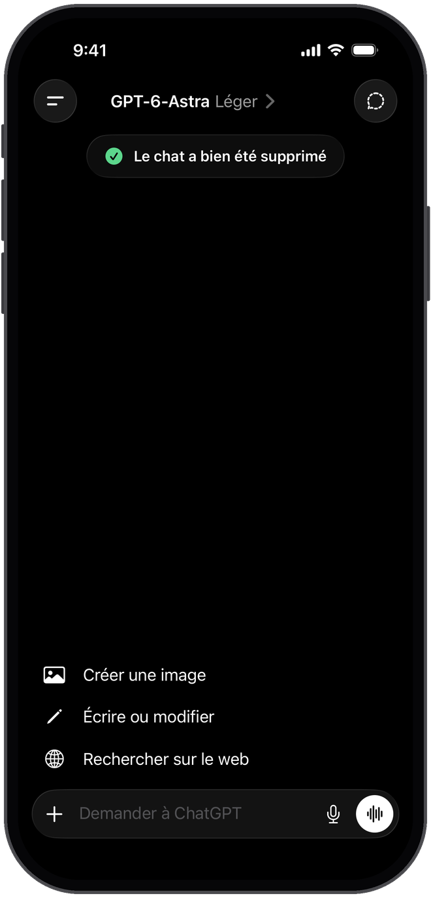 |
| **Réglages** | **Paramètres de l'application** | **À propos** |
|  | 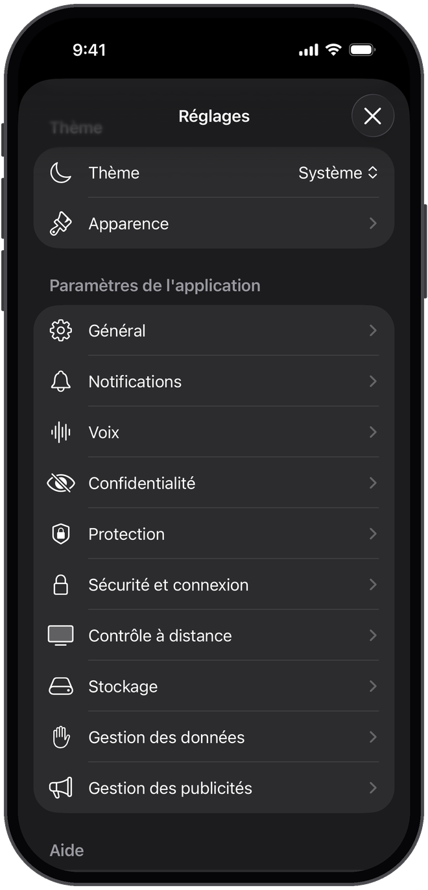 | 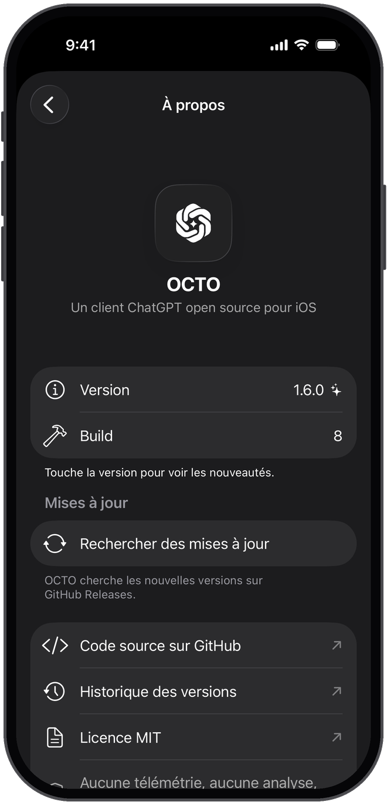 |
| **Forfait Free** | **Thème clair** | **Nouveautés** |
| 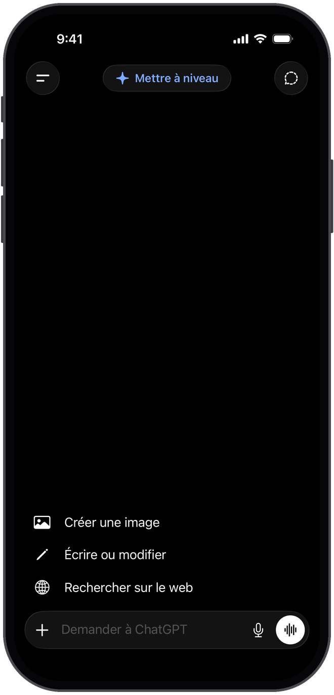 | 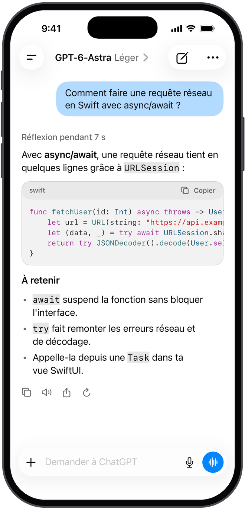 | 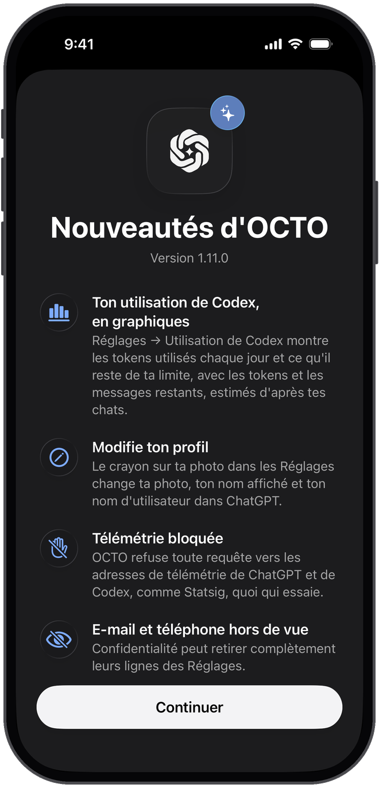 |
| **Abonnement** | **Apparence** | **Confidentialité** |
| 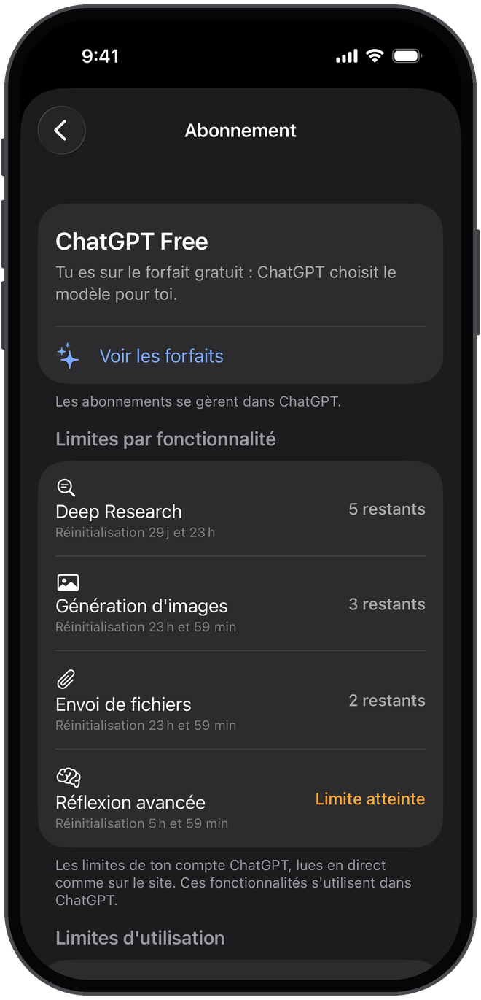 | 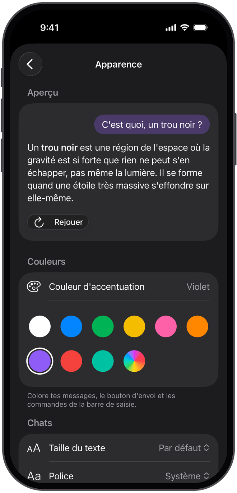 | 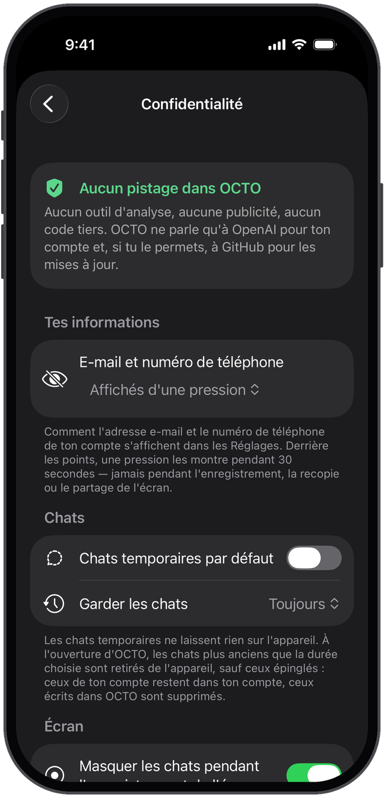 |
| **Gestion des données** | **Vérification de l'âge** | **Mise à jour disponible** |
| 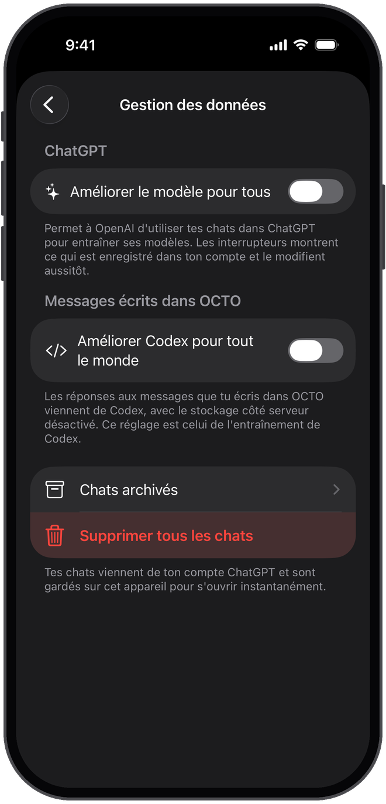 | 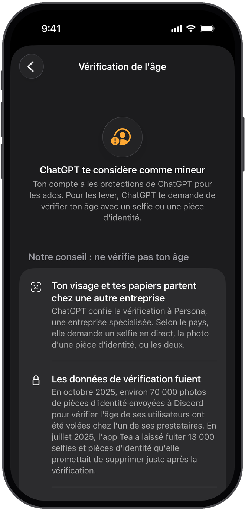 | 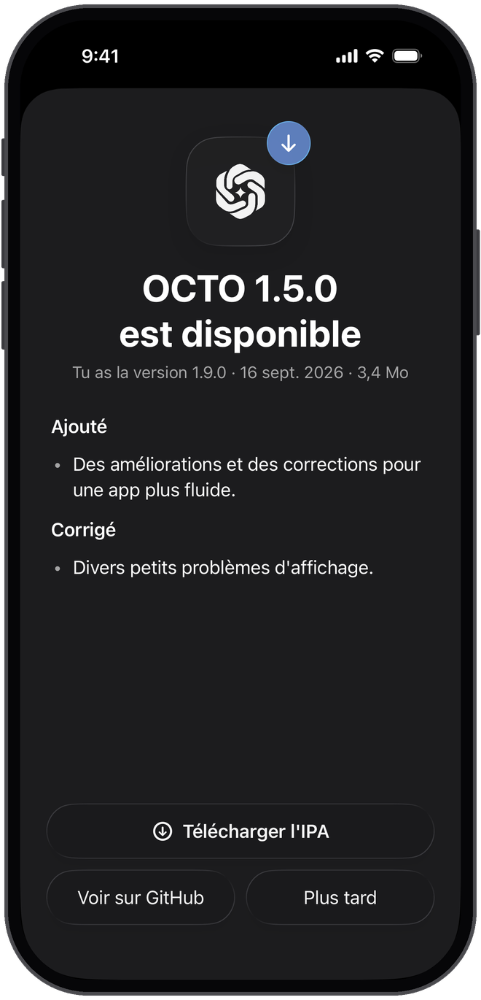 |
| **Mode développeur** | **Inspecteur réseau** | **Détails des messages** |
| 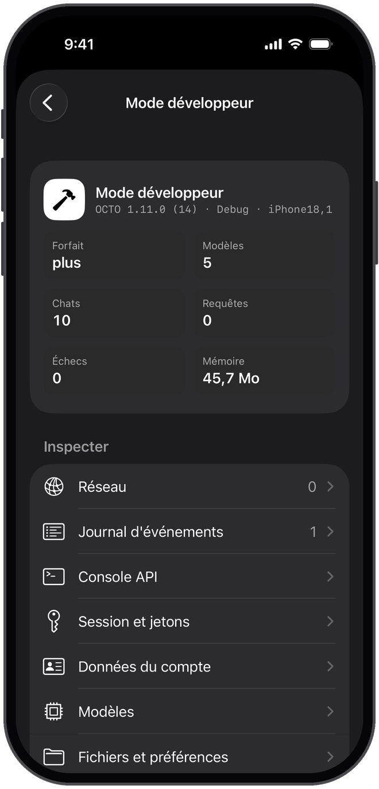 | 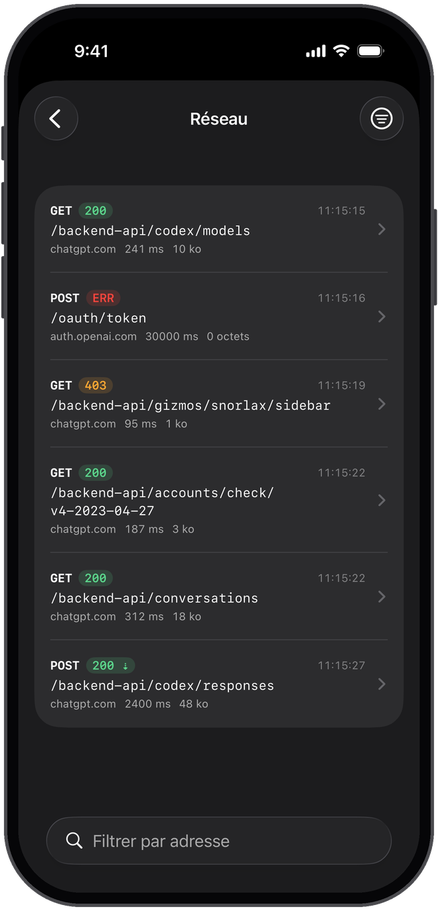 | 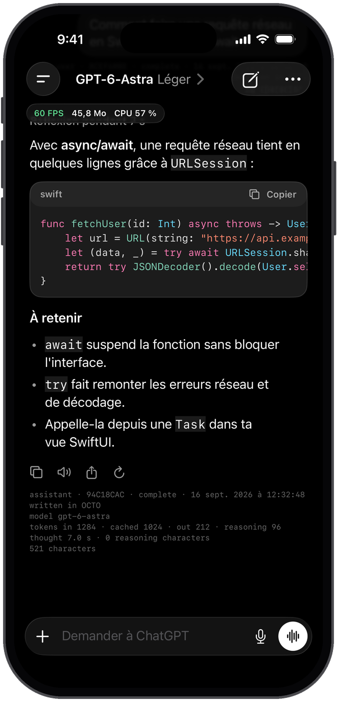 |
| **Appareils connectés** | **Stockage** | **Mémoire** |
| 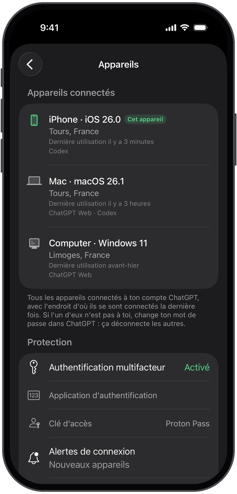 | 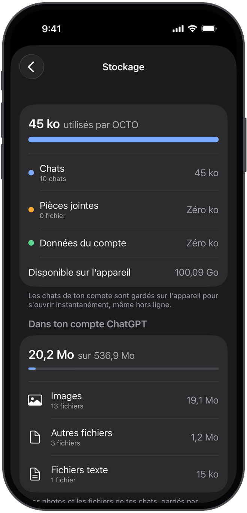 | 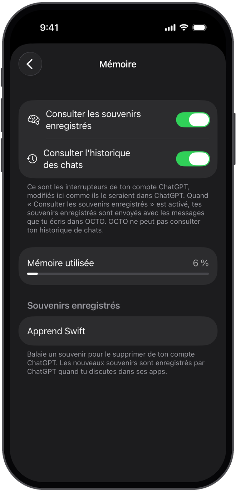 |
| **Forfaits ChatGPT** | | |
| 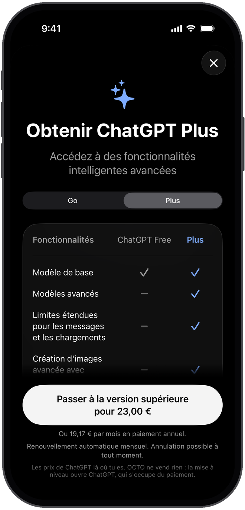 | | |

Ces captures sont prises automatiquement sur un simulateur iPhone 17 Pro par le workflow [`screenshots.yml`](.github/workflows/screenshots.yml), avec un compte et des chats de démonstration.

## ✨ Fonctionnalités

- **Connexion avec ton compte ChatGPT** (Free, Plus, Pro, Business…) via OAuth, comme la CLI officielle et open source [Codex](https://github.com/openai/codex), ou avec un code d'appareil.
- **Tes chats et tes projets viennent de ton compte** : chaque chat s'ouvre avec ses messages, sa réflexion et ses sources. Renommer ou supprimer un chat le fait aussi dans ton compte, avec une confirmation, et les chats archivés restent consultables.
- **Recherche dans tout ton compte** : la barre de recherche interroge aussi ChatGPT (`conversations/search`), qui cherche **dans les messages**, y compris ceux des chats jamais ouverts sur cet iPhone. Le passage qui correspond s'affiche sous le titre, et ouvrir un résultat télécharge le chat.
- **Interface calquée sur l'app ChatGPT**, construite avec les composants **Liquid Glass** natifs d'iOS 26 : barres d'outils en verre, barre de saisie en capsule de verre avec le bouton + à l'intérieur, suggestions d'accueil en liste, bouton « Mettre à niveau » en haut pour les comptes sans abonnement, menus, boutons `.glass` et feuilles système. **Glisse vers la droite n'importe où dans la conversation** pour faire venir tes chats.
- **Réglages organisés comme ChatGPT, sans doublon** — chaque réglage à un seul endroit : Personnalisation, Mémoire, Plugins, compte (e-mail et téléphone **masquables**, abonnement, restaurer les achats, vérification de l'âge), thème et apparence, Général, Notifications, Voix, Confidentialité, Protection, Sécurité et connexion (avec les **appareils connectés**), Stockage, Gestion des données et Aide.
- **Réponses qui arrivent mot par mot, en fondu**, à la vitesse de ton choix (lente, normale, rapide ou instantanée), sans que le chat défile tout seul. Rendu Markdown (titres, listes, tableaux, citations) et blocs de code colorés avec bouton « Copier ».
- **Personnalisable** : thème Système, Clair ou Sombre, couleurs d'accentuation de ChatGPT et couleur de ton choix, taille du texte et police des chats, retour à la ligne dans le code, vibrations pendant que ChatGPT écrit, envoi avec la touche Retour, et un **écran d'accueil à ta main** (bouton « Mettre à niveau », salutation, suggestions en liste ou en pastilles).
- **Choix du modèle et du niveau de réflexion** depuis le titre du chat, avec le catalogue de modèles de ton compte. Comme dans ChatGPT, le sélecteur n'apparaît qu'avec un abonnement.
- **Création d'images** : « Créer une image » demande l'outil d'images de l'API Responses au **backend Codex de ton forfait**, et l'image arrive dans la conversation. Ce backend ne propose que les outils des clients Codex : s'il refuse, OCTO repose la question sans l'outil, répond avec des mots et te le dit.
- **Dictée par ChatGPT** (`backend-api/transcribe`, comme la dictée de ses apps) ou entièrement sur l'appareil, et **mode vocal** : parle à ChatGPT et écoute sa réponse, lue à voix haute phrase par phrase avec la voix de ton choix. Si la dictée est **désactivée dans les réglages de ton iPhone**, OCTO le voit, le dit et propose d'ouvrir les Réglages.
- **Gestion des données** : « Améliorer le modèle pour tout le monde », l'inclusion de l'audio et de la vidéo et le réglage équivalent de Codex sont lus et modifiés **directement dans ton compte**.
- **Vérification de l'âge** : ce que ChatGPT pense de ton âge (`settings/is_adult`), et pourquoi ne pas lui confier ton visage ni tes papiers.
- **Protection** : verrouillage par Face ID, contenu masqué dans le sélecteur d'apps et pendant l'enregistrement de l'écran.
- **Appareils connectés** : la liste des appareils connectés à ton compte ChatGPT (`accounts/sessions`), avec la ville, le pays, la dernière connexion et les apps qui s'en servent, plus l'état de ta double authentification, de tes clés d'accès et des alertes de connexion (`accounts/security_settings/info`, `accounts/mfa_info`). De quoi repérer une connexion qui n'est pas la tienne.
- **Stockage** : ce qu'OCTO occupe sur l'iPhone, et ce que les fichiers de tes chats occupent **dans ton compte ChatGPT** (`files/library/storage/usage`), par type de fichier.
- **Notifications** quand une réponse se termine alors qu'OCTO est en arrière-plan.
- **Résumé de la réflexion**, **recherche web** avec sources, **pièces jointes** (photos, appareil photo, fichiers texte) et **lecture à voix haute**.
- **Limites d'utilisation lues en direct depuis ton compte** : comme sur le site (`conversation/init`), l'écran Abonnement montre ce qu'il te reste de Deep Research, de générations d'images, d'envois de fichiers et de réflexion avancée, avec leur date de réinitialisation.
- **Chats temporaires**, au choix par défaut, qui ne laissent aucune trace, et suivi des **limites d'utilisation** de ton forfait.
- **Mises à jour détectées** sur GitHub Releases, avec les nouveautés et l'installation par AltStore ou SideStore.
- **Mode développeur** complet (voir plus bas) et **écran « Nouveautés »** après chaque mise à jour (voir le [CHANGELOG](CHANGELOG.md)).
- Interface en français et en anglais.

## 🔒 Confidentialité

- **Aucune télémétrie**, aucun outil d'analyse, **aucune dépendance tierce**.
- Les requêtes partent **directement de ton iPhone vers OpenAI** (`auth.openai.com` et `chatgpt.com`), et vers `api.github.com` pour chercher les mises à jour si tu le laisses activé, sans cookie ni identifiant. Réglages → Confidentialité liste chaque serveur contacté depuis l'ouverture de l'app.
- Ton **adresse e-mail et ton numéro de téléphone restent cachés** derrière des points dans les Réglages : une pression les montre 30 secondes, ou bien ils ne se montrent jamais, ou seulement quand l'écran n'est pas enregistré, recopié ni partagé — de quoi ouvrir les Réglages en live sans rien dévoiler.
- Les jetons de connexion sont stockés dans le **trousseau iOS**. La session réseau est éphémère : rien n'est mis en cache sur le disque et les cookies disparaissent à la fermeture et à la déconnexion. Ta photo de profil n'est demandée avec ta session que si elle est hébergée sur `chatgpt.com`.
- Les chats de ton compte sont gardés **sur l'appareil**, dans des fichiers **illisibles tant que l'iPhone est verrouillé**, et peuvent en être retirés au bout d'un jour, d'une semaine ou d'un mois. Les messages que tu écris dans OCTO sont envoyés avec `store: false`.
- Les liens des réponses s'ouvrent, se copient et se partagent **sans traceurs** (`utm_source=chatgpt.com`, `fbclid`…). Le texte copié **reste sur l'iPhone** et peut s'effacer tout seul.
- Les **claviers tiers sont bloqués**, et les chats sont **masqués pendant l'enregistrement ou le partage de l'écran**.
- La dictée par ChatGPT envoie l'enregistrement à OpenAI, puis l'efface de l'iPhone. La dictée sur l'appareil et le mode vocal utilisent la reconnaissance vocale d'Apple **sur l'appareil** quand elle est disponible.
- « Signaler un problème » ne joint que les versions d'OCTO et d'iOS, le modèle de l'appareil et la langue, et seulement si tu le laisses activé.

## 📲 Installation

OCTO n'est pas sur l'App Store. Chaque version est publiée dans les [Releases](https://github.com/gabrielb0x/OCTO/releases) avec un **IPA non signé** (`OCTO-x.y.z.ipa`) :

1. Télécharge l'IPA de la dernière release. Les builds de chaque commit sont aussi dans l'onglet [Actions](https://github.com/gabrielb0x/OCTO/actions) (artefact `OCTO-unsigned-ipa`).
2. Installe-le avec un outil de sideloading qui signe l'app avec ton identifiant Apple, par exemple [AltStore](https://altstore.io), [SideStore](https://sidestore.io) ou [Sideloadly](https://sideloadly.io).

OCTO nécessite **iOS 26** ou une version plus récente. Quand une nouvelle version sort, OCTO te la propose et peut l'ouvrir directement dans AltStore ou SideStore.

## 🔑 Connexion et compte

- **Continuer avec ChatGPT** ouvre la page de connexion officielle d'OpenAI dans une feuille Safari sécurisée. OCTO utilise le même client OAuth public (PKCE) que Codex CLI et reçoit la redirection sur `localhost:1455`, directement sur l'appareil.
- **Se connecter avec un code** : saisis le code affiché sur `auth.openai.com/codex/device` depuis n'importe quel appareil. Si besoin, active l'autorisation par code d'appareil pour Codex dans les paramètres de sécurité de ChatGPT.
- La connexion avec une clé API OpenAI n'est plus proposée pour l'instant.

Avec la même session, OCTO lit ton compte sur `chatgpt.com/backend-api` : profil, abonnement, réglages, instructions personnalisées, personnalité, mémoire, chats, projets, statut de l'âge et réglages d'entraînement. Tes instructions, ta personnalité et « Améliorer le modèle pour tout le monde » peuvent être modifiés depuis l'app, avec les mêmes requêtes que le site. Les réglages propres aux apps officielles (plugins, contrôle à distance, publicités) expliquent ce qu'ils font et ouvrent ChatGPT.

Les réponses sont générées par le backend Codex de ton forfait et décomptées de ses **limites d'utilisation Codex** (visibles dans Réglages → Abonnement). Les messages écrits dans OCTO ne sont donc pas ajoutés à tes chats sur chatgpt.com : ils restent sur l'appareil, et une mention l'indique dans les chats venant du compte.

## 🧪 Mode développeur

Dans Réglages → Aide → À propos, **touche 8 fois de suite le numéro de build**. Une section « Développeur » apparaît alors dans les réglages :

- **Inspecteur réseau** : chaque requête avec son statut, sa durée, sa taille, ses en-têtes, ses corps (JSON indenté), les événements du streaming et une commande cURL. Les jetons, cookies, codes OAuth et fichiers envoyés sont masqués, et rien n'est enregistré sur le disque ni envoyé.
- **Journal d'événements** : synchronisations, jetons, réponses, dictée, mises à jour, erreurs détaillées, filtrable et partageable.
- **Console API** en lecture seule sur `chatgpt.com/backend-api`, avec des raccourcis.
- **Inspecteurs** : session et claims des jetons, données du compte et de l'abonnement, modèles, fichiers les plus lourds, préférences, appareil et build.
- **Affichage** : overlay de performances (FPS, mémoire, CPU), détails techniques sous chaque message, Markdown brut, texte sans animation, animations ralenties.
- **Simulation** : forfait Free, Go, Plus ou Pro, sélecteur de modèle forcé, pannes (hors ligne, blocage Cloudflare, erreur serveur, réponse coupée, délai de connexion).
- **Actions** : synchroniser, actualiser le compte, actualiser ou faire expirer les jetons, notification de test, nouveautés, cache des modèles, recherche de mise à jour, et **export d'un rapport de diagnostic**.

## 🛠️ Compiler

Prérequis : macOS avec **Xcode 26** et [XcodeGen](https://github.com/yonaskolb/XcodeGen).

```bash
brew install xcodegen
xcodegen generate
open OCTO.xcodeproj
```

Tests du module `OCTOCore` (ils tournent aussi sous Linux) :

```bash
cd Packages/OCTOCore
swift test
```

### Captures d'écran

Le drapeau de compilation `OCTO_DEMO` ajoute des scènes de démonstration (`welcome`, `home`, `chat`, `sidebar`, `voice`, `settings`, `settingsApp`, `subscription`, `about`, `developer`, `network`, `deleteToast`, `freePlan`, `lightChat`, `messageDetails`, `whatsNew`, `appearance`, `privacy`, `dataControls`, `ageVerification`, `update`), sans réseau ni trousseau. Il n'est jamais présent dans l'IPA.

```bash
xcodebuild build -project OCTO.xcodeproj -scheme OCTO -configuration Debug \
  -destination 'platform=iOS Simulator,name=iPhone 17 Pro' -derivedDataPath build/DerivedData \
  SWIFT_ACTIVE_COMPILATION_CONDITIONS='DEBUG OCTO_DEMO'
Scripts/take-screenshots.sh build/DerivedData/Build/Products/Debug-iphonesimulator/OCTO.app build/screenshots
python3 Scripts/frame-screenshots.py build/screenshots docs/screenshots
```

### GitHub Actions

- [`build.yml`](.github/workflows/build.yml), à chaque push :
  - **Core tests** : `swift test` sur `OCTOCore`.
  - **Build iOS app** : génère le projet avec XcodeGen, compile en Release sans signature sur `macos-26` et publie l'artefact `OCTO-unsigned-ipa`.
  - **Publish release** : pour un tag `v*` (par exemple `git tag v1.2.0 && git push origin v1.2.0`), crée une release GitHub avec l'IPA `OCTO-1.2.0.ipa` et la section correspondante du CHANGELOG.
- [`screenshots.yml`](.github/workflows/screenshots.yml), quand l'app change : lance les scènes de démonstration sur un simulateur iPhone 17 Pro, ajoute un cadre d'iPhone et enregistre les images dans `docs/screenshots`.

## 🧱 Architecture

```
OCTO/                  App SwiftUI
├── App/               Point d'entrée, AppModel, notes de version et scènes de démonstration
├── Services/          Connexion OAuth et trousseau, compte ChatGPT, streaming, stockage, voix et dictée,
│   └── Developer/     confidentialité, mises à jour, notifications, Face ID, toasts ; outils du mode développeur
├── Features/          Onboarding, Main, Sidebar, Chat, Voice, Markdown, Settings, Updates, Developer, WhatsNew
├── DesignSystem/      Thème clair et sombre, couleurs d'accentuation, composants Liquid Glass
└── Resources/         Icônes, logo et traductions
Packages/OCTOCore/     Logique Swift testée : protocole OpenAI, SSE, compte ChatGPT (chats, réglages,
                       abonnement, âge, dictée), forfaits, mises à jour, nettoyage des liens, masquage
                       des identifiants, Markdown, rythme mot par mot des réponses
Scripts/               Captures d'écran sur simulateur et cadre d'iPhone
docs/screenshots/      Captures utilisées par ce README
project.yml            Définition du projet XcodeGen
```

## ⚠️ Avertissement

OCTO est un projet indépendant, **ni affilié ni approuvé par OpenAI**. « ChatGPT » et « OpenAI » sont des marques d'OpenAI. L'app est destinée à un usage personnel et non commercial : tu restes responsable du respect des [conditions d'utilisation d'OpenAI](https://openai.com/policies/terms-of-use).

## 📄 Licence

[MIT](LICENSE) © 2026 Gabriel B.
