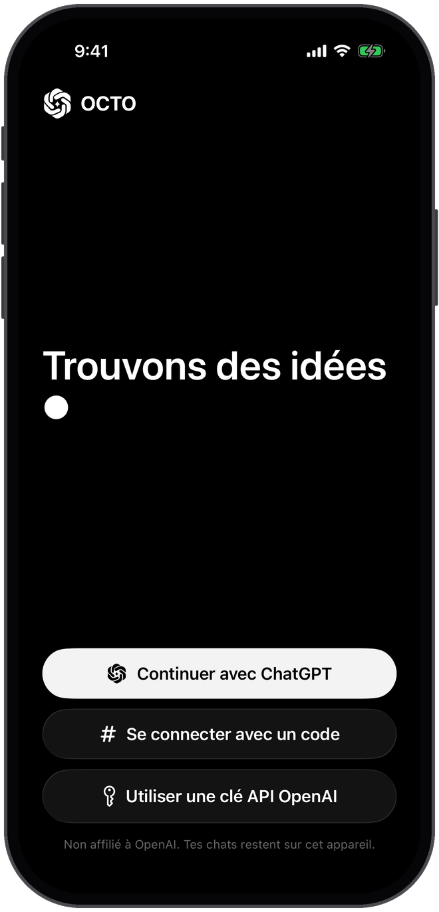
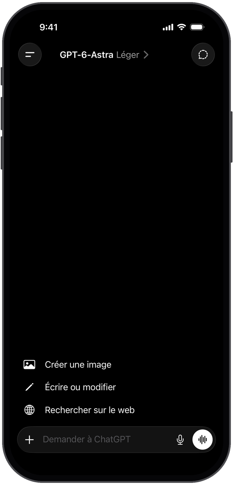
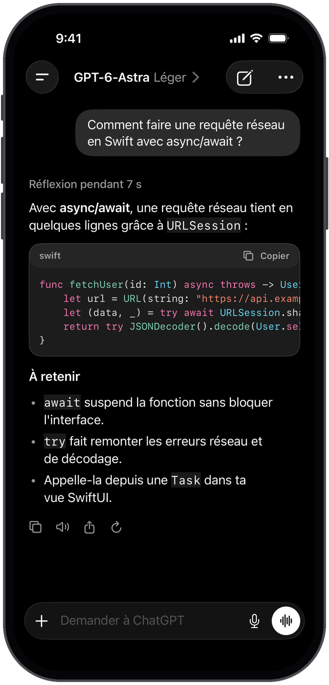
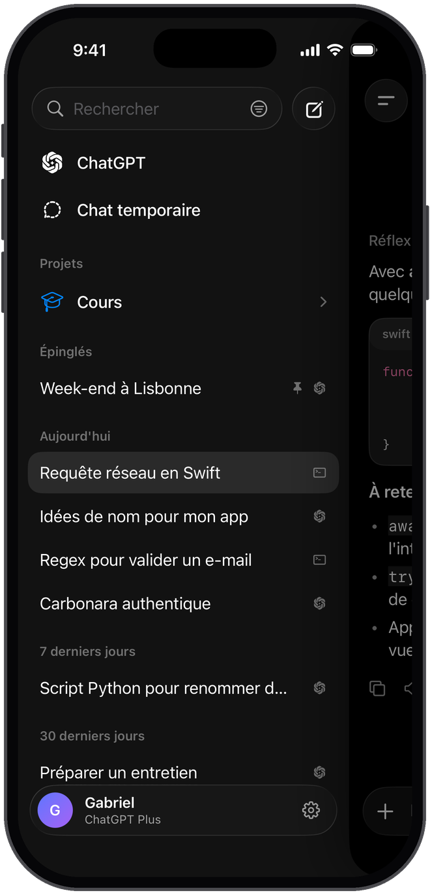
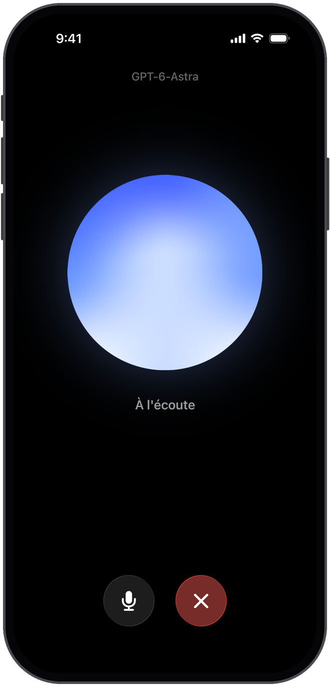
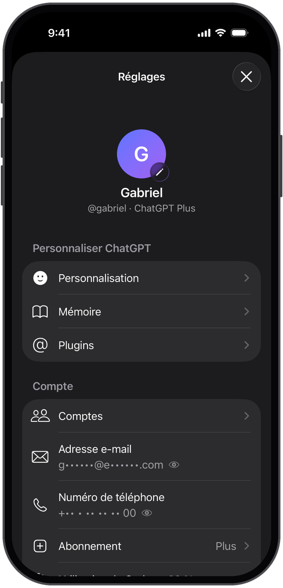

<p align="center">
  
</p>

<h1 align="center">OCTO</h1>

<p align="center">
  Un client ChatGPT open source pour iOS 26, sans télémétrie, qui reprend l'interface de l'app ChatGPT avec les composants Liquid Glass d'Apple.<br>
  <em>An open-source, telemetry-free ChatGPT client for iOS, built with Apple's Liquid Glass.</em>
</p>

---

## 📱 Aperçu

| Connexion | Nouveau chat | Conversation |
|:---:|:---:|:---:|
|  |  |  |
| **Barre latérale** | **Mode vocal** | **Réglages** |
|  |  |  |

Ces captures sont prises automatiquement sur un simulateur iPhone 17 Pro par le workflow [`screenshots.yml`](.github/workflows/screenshots.yml), avec un compte et des chats de démonstration.

## ✨ Fonctionnalités

- **Connexion avec ton compte ChatGPT** (Plus, Pro, Business…) via OAuth, comme la CLI officielle et open source [Codex](https://github.com/openai/codex), ou **avec une clé API OpenAI**.
- **Interface calquée sur l'app ChatGPT**, construite avec les composants **Liquid Glass** natifs d'iOS 26 : barres d'outils en verre, barre de saisie en capsule, menus, boutons `.glass` et feuilles système.
- **Réponses en streaming** avec rendu Markdown (titres, listes, tableaux, citations) et blocs de code colorés avec bouton « Copier ».
- **Choix du modèle et du niveau de réflexion** depuis le titre du chat, avec le catalogue de modèles de ton compte récupéré en direct. Appui long sur « Régénérer » pour relancer une réponse avec un autre modèle.
- **Mode vocal** : parle à OCTO et écoute sa réponse, lue à voix haute phrase par phrase. La reconnaissance vocale se fait sur l'appareil.
- **Résumé de la réflexion** (« Réflexion pendant 12 s ») et **recherche web** avec sources.
- **Pièces jointes** : photos, appareil photo et fichiers texte.
- **Dictée** et **lecture à voix haute** des réponses.
- Historique local avec recherche, épinglage, renommage et titres générés automatiquement.
- **Chats temporaires** qui ne laissent aucune trace.
- **Instructions personnalisées** et suivi des **limites d'utilisation** de ton forfait.
- Interface sombre, en français et en anglais.

## 🔒 Confidentialité

- **Aucune télémétrie**, aucun outil d'analyse, **aucune dépendance tierce**.
- Les requêtes partent **directement de ton iPhone vers OpenAI** (`auth.openai.com` et `chatgpt.com`, ou `api.openai.com` avec une clé API). Aucun serveur intermédiaire.
- Les jetons de connexion et la clé API sont stockés dans le **trousseau iOS**.
- Les conversations sont enregistrées **uniquement sur l'appareil** et envoyées avec `store: false`.
- Le mode vocal et la dictée utilisent la reconnaissance vocale d'Apple **sur l'appareil** quand elle est disponible.

## 📲 Installation

OCTO n'est pas sur l'App Store. Chaque build GitHub Actions produit un **IPA non signé** :

1. Ouvre l'onglet [Actions](https://github.com/gabrielb0x/OCTO/actions), choisis le dernier build réussi et télécharge l'artefact `OCTO-unsigned-ipa`. Pour les versions taguées, l'IPA est aussi dans les [Releases](https://github.com/gabrielb0x/OCTO/releases).
2. Installe-le avec un outil de sideloading qui signe l'app avec ton identifiant Apple, par exemple [AltStore](https://altstore.io), [SideStore](https://sidestore.io) ou [Sideloadly](https://sideloadly.io).

OCTO nécessite **iOS 26** ou une version plus récente.

## 🔑 Connexion

- **Continuer avec ChatGPT** ouvre la page de connexion officielle d'OpenAI dans une feuille Safari sécurisée. OCTO utilise le même client OAuth public (PKCE) que Codex CLI et reçoit la redirection sur `localhost:1455`, directement sur l'appareil.
- **Se connecter avec un code** : saisis le code affiché sur `auth.openai.com/codex/device` depuis n'importe quel appareil. Si besoin, active l'autorisation par code d'appareil pour Codex dans les paramètres de sécurité de ChatGPT.
- **Clé API OpenAI** : utilisation facturée à l'usage par OpenAI.

Avec un compte ChatGPT, les messages sont décomptés des **limites d'utilisation Codex** incluses dans ton forfait (visibles dans Réglages → Limites d'utilisation). L'historique n'est pas synchronisé avec chatgpt.com.

## 🛠️ Compiler

Prérequis : macOS avec **Xcode 26** et [XcodeGen](https://github.com/yonaskolb/XcodeGen).

```bash
brew install xcodegen
xcodegen generate
open OCTO.xcodeproj
```

Tests du module `OCTOCore` (ils tournent aussi sous Linux) :

```bash
cd Packages/OCTOCore
swift test
```

### Captures d'écran

Le drapeau de compilation `OCTO_DEMO` ajoute des scènes de démonstration (`welcome`, `home`, `chat`, `sidebar`, `voice`, `settings`), sans réseau ni trousseau. Il n'est jamais présent dans l'IPA.

```bash
xcodebuild build -project OCTO.xcodeproj -scheme OCTO -configuration Debug \
  -destination 'platform=iOS Simulator,name=iPhone 17 Pro' -derivedDataPath build/DerivedData \
  SWIFT_ACTIVE_COMPILATION_CONDITIONS='DEBUG OCTO_DEMO'
Scripts/take-screenshots.sh build/DerivedData/Build/Products/Debug-iphonesimulator/OCTO.app build/screenshots
python3 Scripts/frame-screenshots.py build/screenshots docs/screenshots
```

### GitHub Actions

- [`build.yml`](.github/workflows/build.yml), à chaque push :
  - **Core tests** : `swift test` sur `OCTOCore`.
  - **Build iOS app** : génère le projet avec XcodeGen, compile en Release sans signature sur `macos-26` et publie l'artefact `OCTO-unsigned-ipa`.
  - **Publish release** : pour un tag `v*` (par exemple `git tag v1.0.0 && git push origin v1.0.0`), crée une release GitHub avec l'IPA.
- [`screenshots.yml`](.github/workflows/screenshots.yml), quand l'app change : lance les scènes de démonstration sur un simulateur iPhone 17 Pro, ajoute un cadre d'iPhone et enregistre les images dans `docs/screenshots`.

## 🧱 Architecture

```
OCTO/                  App SwiftUI
├── App/               Point d'entrée, AppModel et scènes de démonstration
├── Services/          Connexion OAuth et trousseau, streaming, stockage, voix
├── Features/          Onboarding, Main, Sidebar, Chat, Voice, Markdown, Settings
├── DesignSystem/      Thème sombre et composants Liquid Glass
└── Resources/         Icônes, logo et traductions
Packages/OCTOCore/     Logique Swift testée : protocole OpenAI, SSE,
                       Markdown, coloration syntaxique, modèles, voix
Scripts/               Captures d'écran sur simulateur et cadre d'iPhone
docs/screenshots/      Captures utilisées par ce README
project.yml            Définition du projet XcodeGen
```

## ⚠️ Avertissement

OCTO est un projet indépendant, **ni affilié ni approuvé par OpenAI**. « ChatGPT » et « OpenAI » sont des marques d'OpenAI. L'app est destinée à un usage personnel et non commercial : tu restes responsable du respect des [conditions d'utilisation d'OpenAI](https://openai.com/policies/terms-of-use).

## 📄 Licence

[MIT](LICENSE) © 2026 Gabriel B.
